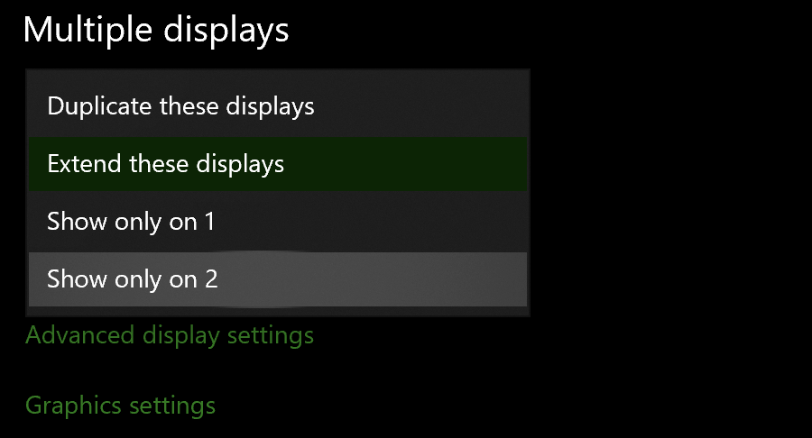

Even though ESXi is a [relatively mature hypervisor](https://en.wikipedia.org/wiki/Timeline_of_virtualization_development#Year_1999), PCI passthrough with a GPU is notoriously finicky.  The official documentation oversimplifies the process, and lots of tutorials online say that only workstation GPU's (like the Quadro series) will work, and some walk you through a complex choreography of custom-installing drivers and even taping pins on the PCI connector.  Here's what worked for me:

# Configuring the VM

First, I added a new virtual machine and installed Windows.  This is straightforward, just make sure to expand the CPU dropdown menu and put all of the vCPU's in one or two sockets, instead of presenting each as a separate CPU.  Upload the Windows installer iso image from Microsoft to your server's datastore, and then add a new CD device with the iso image.  The VM will automatically boot from this image to install Windows.

# Installing Windows

Turn on the virtual machine using the green play button and walk through the installer steps.  The only thing that I do uniquely here is I always make an offline account.  I'm kind of a nut about privacy, and I personally don't need to have my os tied to a Microsoft account on the os level, along with all of the [telemetry](https://docs.microsoft.com/en-us/windows/privacy/manage-windows-2004-endpoints) that Microsoft gobbles up.  Honestly, I would never use Windows bare-metal on a personal machine.

# Enabling PCI Passthrough

First, disable auto-start, shut down your server, unplug, and install the GPU in a PCI slot **with the correct power rating**.  I messed that up a few times.  When you boot up your server, go to the PCI devices page, select your GPU, and click "toggle passthrough."

I'm using a NVIDIA GT 710 because it's all I have, and it happens to use very little power.  After you toggle passthrough, enable auto-start again and restart the server.  Now, when you edit the configuration for you VM, you can click "Add other device" -> "PCI device."  Your GPU should be automatically selected as the PCI device, unless you have others enabled.  Be sure to select "reserve all memory" under the memory dropdown.  

Before you power the VM on, click on "VM Options" at the top, expand "Advanced," and then edit the configuration.  Add this new key/value pair to the parameters:

<table style="width:100%">
	<tr>
		<th>Key</th>
		<th>Value</th>
	</tr>
	<tr>
		<td>hypervisor.cpuid.v0</td>
		<td>FALSE</td>
	</tr>
</table>

# Making Windows Cooperate

At long last, you should be able to boot up Windows! It will automatically recognize the GPU and install the drivers, whether you like it or not.  One last thing: If you're only going to use Windows through the GPU and not with the VMWare virtual console, you will need to disable the console display in Windows.  To do this, simply open up the boxy, stupid-looking settings window (not the 2010 maze of hyperlinks–I don't know why there are two settings programs) and click on "System." Then go to the "Display" tab and select the dropdown "Multiple Displays" to show only on display 1 or 2, depending on which is your vm console and which is your gpu.  You're done!

