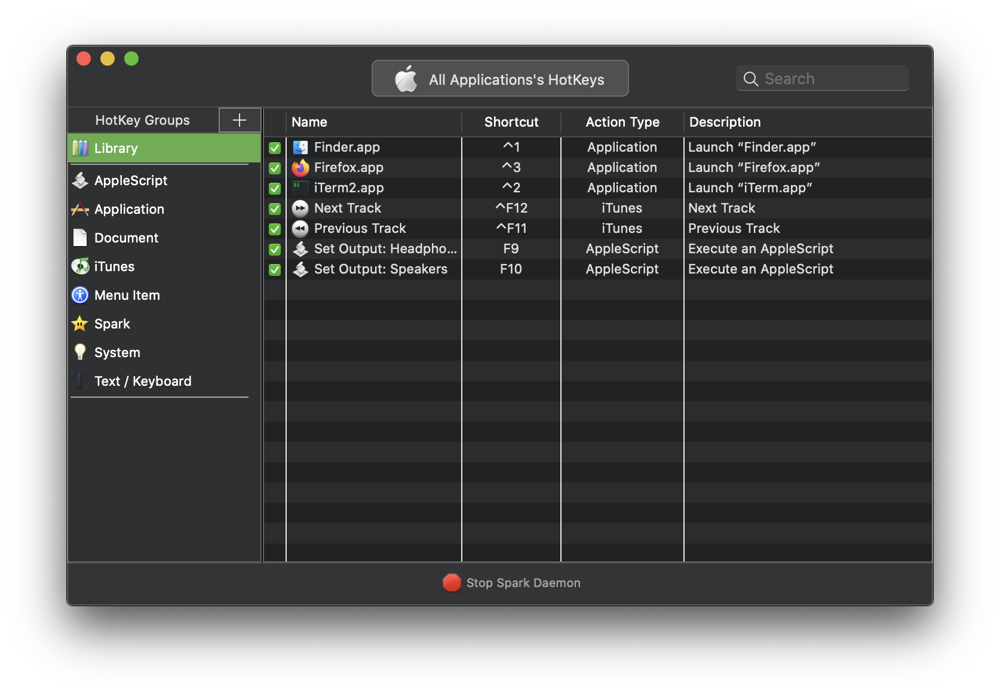
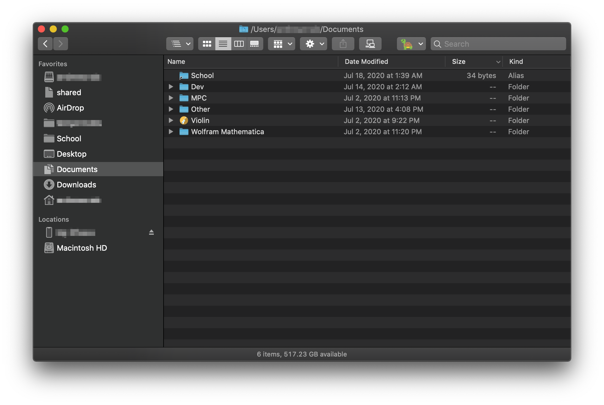

I strive for my Mac to be as unobtrusive as possible so I can focus on doing what I want to do.  This is the primary reason I use MacOS: there's intuitive and consistent design that makes it easy to get things done quickly without sacrificing powerful functionality.  Here are a few small things that I've done (with the help of some incredible third-party apps) to make my Mac work for me.  I hope you might find one or two helpful things in here as well.

## Desktop


First things first, I actually disable drawing files and folders on the desktop using this command:

    defaults write com.apple.finder CreateDesktop -bool false; killall Finder
    
I found I really like the cleanliness of it, since I never really opened things on my desktop anyway.  This also lets you still use your Desktop folder as a place to store files.  

### Menubar
I used to love having all the little widgets in my menu bar.  Now, I don't, so I use this app [Vanilla](https://matthewpalmer.net/vanilla/) by Matthew Palmer.  It works mostly great, and the aesthetic is hard to beat.
  


### Dock
Finally, I hide the Dock at the bottom of the screen.  This wasn't a huge deal whan I used to have the Hackintosh with a larger screen, but with a laptop I think the reclaimed screen real estate is pretty valuable.  

One way I like to organize my dock is by placing little spaces between the categories of apps that I use.  For example, my utilities in the first space, then my web apps, then my communication apps, etc.  

<picture>
	<source srcset="../../images/Dock.webp" type="image/webp">
	<source srcset="../../images/Dock.png" type="image/png">
	
</picture>


This is made possible through a phenomenal app called [TinkerTool](https://www.bresink.com/osx/TinkerTool.html).  I also opted to get rid of the Downloads stack at the right side of the Dock, and I turned off the recent applications thing because it was annoying and redundant.  Showing recents in the dock is the last option in the Dock preferences pane of System Preferences:


## Keyboard Shortcuts

I *love* keyboard shortcuts.  Not only are they usually faster than a mouse, but they make you look like a bona fide computer guru.  I use [Spark](https://www.shadowlab.org/softwares/spark.php) along with [Karabiner Elements](https://karabiner-elements.pqrs.org/) to handle my custom keyboard shortcuts.  

Generally, in MacOS, the control key isn't used very much as far as system keyboard shortcuts go.  Therefore, I map my three most frequently used apps, Finder, iTerm2, and Firefox, to the numbers 1, 2, and 3 respectively using control-down.  It's soo much faster than moving your cursor down to the dock.

Since I frequently use a windows mechanical keyboard with my Mac, I really wanted to use the delete key to trash files instead of command+backspace every time.  Maybe you have this issue, too.  I executed this command in terminal:

```bash
defaults write com.apple.finder NSUserKeyEquivalents -dict-add 'Move to Trash' '\177'
```

I guess this isn't *technically* a keyboard shortcut, but you might find it useful to add some custom actions to the touch bar if you're on a macbook pro with one. 
 


I added actions to toggle Wifi and Bluetooth so I don't have to click in the menu bar.  You can do this by writing a shell script inside an Automator Quick Action.  Here's the shell script I wrote for Wifi:

```bash
POWER=$(networksetup -getairportpower en0 | sed "s/Wi-Fi\ Power (en0):\ //")
if [[ $POWER == 'On' ]]
then
  networksetup -setairportpower en0 off
else
  networksetup -setairportpower en0 on
fi
```
    
And Bluetooth (uses [blueutil](https://www.frederikseiffert.de/blueutil/)):

```bash
POWER=$(/usr/local/bin/blueutil -p)

if [[ POWER -eq 1 ]]
then
  /usr/local/bin/blueutil -p 0
else
  /usr/local/bin/blueutil -p 1
fi
```

## Finder

What I think really helps the finder is to get rid of the things you don't need in the sidebar, and then add in what you do need.  I banished tags, iCloud, and most of the locations because I just don't use them.  

Another small thing that makes me happy is this app called [FinderGo](https://github.com/onmyway133/FinderGo).  This app is a menubar extension and it lets you launch a terminal at the directory you have open in Finder, kinda like you can in Ubuntu or other flavors of Linux.  


