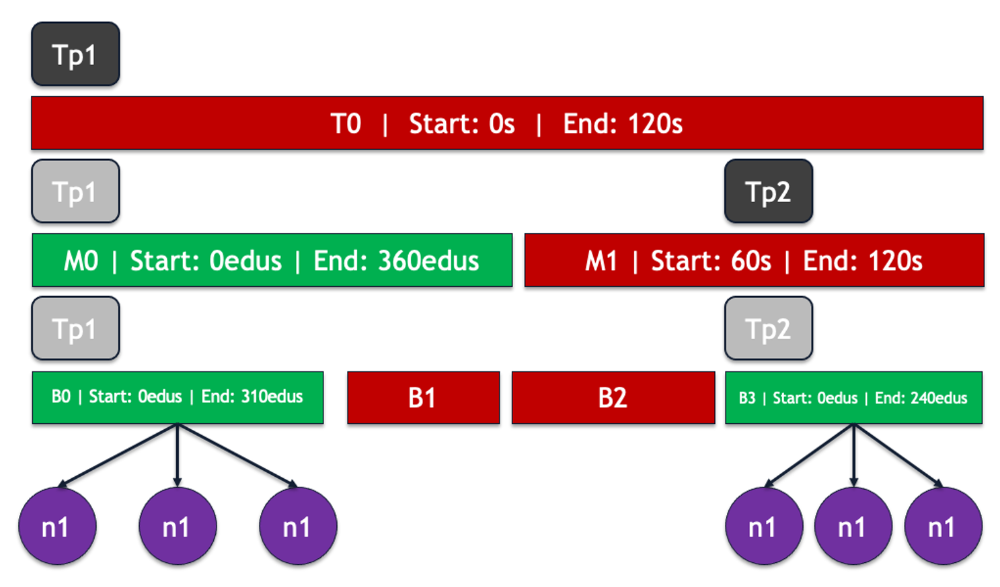
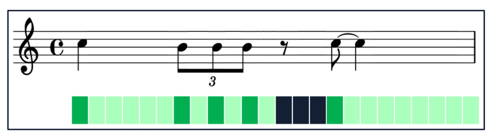

Summer of 2021, I interned with NCSA at UIUC and worked on a project notating stochastic (random) music. The project revolved around a piece of software called DISSCO, or the Digital Instrument for Sound Synthesis and Composition, managed and originally developed by [Dr. Sever Tipei](http://cmp.music.illinois.edu/people/tipei/index.html). I had a great time working on this project and it gave me an opportunity to solve an interesting problem, learn how to navigate a huge codebase, write documentation :grimacing: and level-up my c++ :nerd:. Here's a brief overview of what I did (which is detailed in this [paper](/AndrewOralsFinalReport.pdf) and [presentation](https://www.youtube.com/watch?v=20JLKKQ6odk)) and my thoughts.

## What is DISSCO?

[DISSCO](https://github.com/tipei/DISSCO-2.0.2) is software for computer-assisted algorithmic composition. It is essentially a black-box function that takes in an XML file defining parameters of a composition, performs computations based on these parameters, and then outputs the score as either a sound file or a written score in western notation. The overarching concept is that the person and the computer work together to create a composition, where the human contributes their skill in making artistic decisions, while the computer contributes its "skill" in performing computations quickly. Although you can make deterministic music with DISSCO, it leans heavily towards compositions whose parameters are modulated with a degree of randomness.

## The problem

There are three parts to DISSCO: the GUI for making the XML files, the composition module, and then the additive synthesis module. I was mostly concerned with the composition module (CMOD), because this is what performs the computations for the piece. 

### DISSCO's Event Structure

Internally, CMOD stores the entire piece as a tree, where the nodes are `Event` objects and the leaves are `Note` objects to be synthesized or notated. The only rules are that the topmost event must represent the piece as a whole, there must be at least one bottom event, and child events may only be placed inside their parent's duration. This tree structure represents the piece in layers of abstraction, where the "Top" event represents the piece as a whole, while, for example, its child might represent movements of the piece, and its child might represent sections of the movement, all the way down to the lowest level of abstraction, which could represent a melody or a chord. 



Fundamentally, an event has a start time in seconds relative to the beginning of the piece, a duration in seconds, sometimes a `Tempo`, and then its children, which are also events or a subclass of `Event`, `Bottom`. This structure lends itself naturally to sound synthesis, however not so much to human performance. Unfortunately, most humans don't play music from timestamps; instead, people play music by subdividing and combining units of time in ratios. Then, in order to notate DISSCO's events, there needs to be some concept of discrete positioning on an evenly spaced grid. This is where the EDU comes in.

### EDU's



The EDU (Elementary Displacement Unit) is the basic unit of time in an exact "section" of a DISSCO piece. Exact events additionally have a start time and duration in EDU's, along with a tempo defining the number of EDU's per beat, the number of beats per measure, and also the number of beats per a unit of time (maybe a minute). Any exact children of an exact event inherit the tempo, so this creates an exact "section," which is what can be notated. There are a whole bunch of rules about what happens with different combinations of exact and inexact events, but what matters is that only exact sections which trickle all the way down the tree and produce exact leaves make it into the notated score.

### Previous work

The problem is then notating these discretely-positioned events. Previous work developed reliable methods of notating single musical lines with a uniform tempo and time signature. However, it only functioned on a specific case of compositions, where the top event was exact and this exactness then trickled down through the whole tree, making the tempo implicitly uniform. The previous implementation also had a few more technical issues that needed to be addressed:

- all the notation functionality was implemented as static functions in the `Note` class
- the temporary score data for notation was stored in the global namespace
- there was very little documentation, some of which was misleading or outdated
- no unit tests

## Goals

My tasks seemed pretty simple:

1. Implement and test functionality for notating multiple exact sections separated by other events
2. Improve the documentation and modularity of the notation module

## Refactoring the notation module

Before implementing anything new I completely refactored the notation module to leverage object-oriented design and documented it. This ended up taking dozens of hours following the control flow in gdb and combing through lines of code. What I ended up doing was taking a set of input XML files, running them through CMOD, and then writing down all of the functions related to notation that were called and in what order. After enough inputs, this made a nice call graph that showed two major flows in creating the score: adding the notes to the score while ensuring that the notes are valid in the time signature, and building the score, which quantizes the final output to the EDU grid and finally outputs the score to a text file for [lilypond](https://lilypond.org/).

Since the existing implementation could handle exact sections, I abstracted the notation logic into a `Section` class. The previous implementation stored data in two main places: a two-dimensional vector holding pointers to vectors representing bars containing notes, and a one-dimensional vector containing pointers to notes of the flattened score. I ended up keeping these two data structures but scrapping the vector pointers. Then I created a new interface, clearly delimiting the different stages of creating a section.

```cpp
class Section {
public:
  Section(TimeSignature time_signature);

  Section(const Section& other);

  Section& operator=(const Section& other);

  ~Section();

  bool InsertNote(Note* n);

  void SetDurationEDUS(int edus);

  float GetStartTimeGlobal() const;

  int CalculateEDUsFromSecondsInTempo(float seconds);

  void Build(bool notate_time_signature);

  const list<Note*>& GetSectionFlat();

  //// Private members omitted for brevity ////
};
```

## Extending the functionality

After making the notation logic instantiable, it was time to enable creating multiple of these sections from `Tempo` objects in the score and stitch them together. This necessitated a section manager, called the `NotationScore` class. The notation score has an interface for adding new sections from `Tempo` objects, inserting notes into the score, building the score, and finally outputting the score to a text file for compilation with lilypond.

```cpp
class NotationScore {
public:
  NotationScore();

  /**
   * Construct a notation score with the provided title.
  **/
  NotationScore(const string& score_title);

  /**
   * Insert a Tempo into this score.
  **/
  void RegisterTempo(Tempo& tempo);

  /**
   * Insert a Note into this score.
  **/
  void InsertNote(Note* n);
  
  /**
   * Build the text representation of this score by adding bars,
   * rests, and adjusting durations.
  **/
  void Build();

  /**
   * Output the text representation of a score.
  **/
  friend ostream& operator<<(ostream& output_stream, 
                             NotationScore& notation_score);

  //// Private members omitted for brevity ////
};
```

## Inserting new sections into the score

Inside the composition module, there is no object explicitly representing a notation section. A notation section is just an exact parent and its exact descendants in the event tree. However, the Tempo objects are inherited through exact sections, so `Bottom` objects have a reference to the exact section's tempo. Then, when notes are added to the score, the bottom event simply calls `RegisterTempo` on the score object with its own tempo, representing the exact section. If the tempo doesn't already exist it's added to the score, and then the note is added to the new section.

You might think this sounds ridiculous–why not just append the new sections as the events are built? Unfortunately events are not necessarily built in chronological order, and a section can be composed of any number of bottom events, so each tempo needs to be checked against the score before insertion.

### Distributing `Note` objects into sections

A significant issue that came up is finding the sections into which to insert notes. Since events aren't necessarily built chronologically, notes aren't either, so the score can't be built on the fly. Instead, notes carry a pointer to the "root exact ancestor" from which the exact section is derived. Tempo objects carry this same pointer, and the notes and tempos are matched when the note is inserted.

## Joining notation sections

So now we can create multiple sections of notation, but how do we stitch them together? It's very unlikely that they will meet perfectly, and if they don't, it's also likely that the time span between the two events is not writable in western notation. In most cases, this is resolved by inserting a bar of shortened or lengthened time (a new `Section`) relative to the rhythm of the previous section. 

For example, given sections $S_1$ and $S_2$, after building $S_1$ will have used some quantity of its allotted EDU's leaving a remainder $r$, and its last bar with some quantity of EDU's $b$. If $r < 0$, then the sections overlap and an error is produced. If both $r = 0$ and $b = 0$, the sections align perfectly. In all other cases, `Section` uses an algorithm with the following pseudocode:

```python
pow_2 = 0
min_err = INT_MAX
time_signature_num = 0
time_signature_den = 0

while (prev_section_beat_edus % 2^pow_2 == 0):
  
  tmp_beat_edus = prev_section_beat_edus / 2^pow_2
  
  if ((r + b) % tmp_beat_edus == 0):
    
    // Overhanging time forms a dyadic time signature
    time_signature_num = (r + b) / d
    time_signature_den = prev_section_unit_note * 2^pow_2
    min_err = 0
    break
  
  else:

    // Form a dyadic time signature by adding sound 
    // or rest with the least error
    num_beats = (r + b) / tmp_beat_edus + 1
    err = tmp_beat_edus * num_beats - total_edus_to_use

    if (err < min_err):

      ts_num = num_beats
      ts_den = prev_section_unit_note * 2^pow_2
      min_err = err
  
  pow_2 = pow_2 + 1
```

## Conclusion

Overall, I had a great time solving these problems this summer and learned much more about c++, writing modular code, and even writing documentation :grimacing:. It was also a great opportunity to get better at communicating my ideas and pruning things down to only the most essential points. Anyway, thanks for reading!