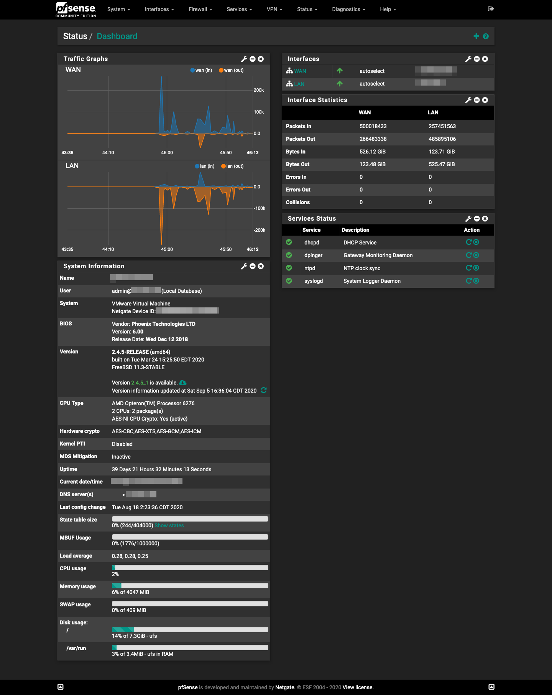
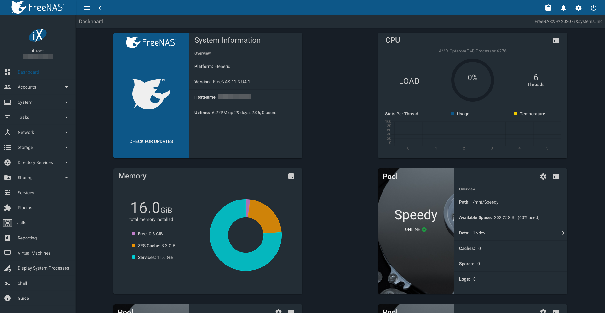

A while ago, I happened to stumble across a contest on r/homelabs on Reddit, where people interested in learning more about "homelabs" could win an item from an assortment of retired (but not that old) network gear.  I couldn't help but enter, and I ended up getting a Dell R715 for free, **with free shipping!**  Honestly, you can almost always find enterprise machines to learn from very cheap on the internet, because they generally use a lot of power (the R715 idles at about 220w, and it's overkill even by the most generous definition), so they're not super appealing for home use.

After a lot of experimentation and learning, I installed VMWare ESXi on a small internal USB flash drive.  Here are the 5 main virtual machines:

<h3>1. PfSense</h3>

[PfSense](https://www.pfsense.org/) is a popular, open-source firewall based on FreeBSD with a custom kernel.  It has a really intuitive web GUI so there's no need to go into the terminal for anything.  I also really like how it automatically configures things like port-forwarding by adding the necessary firewall rules and NAT entries, however it doesn't hide any of the more advanced options to do custom configurations.  The dashboard can also be very indulgent, if that's what you like:

Also, it's really NOT best practice to run a firewall as a virtual machine, because it does increase the surface for any external attackers.  You wouldn't be wrong if you said that all of my eggs are in one basket!  Luckily it's not in production.

<h3>2. FreeNAS</h3>

[FreeNAS](https://www.freenas.org/) is my choice for a file server.  Again, this has a very easy-to-use web GUI and makes the most popular configurations straightforward.  One thing to keep in mind is that you need to have a RAID controller capable of directly presenting the disks to the operating or an actual HBA, because ZFS has its own software RAID. 

<h3>3. PiHole</h3>

The [PiHole](https://pi-hole.net/) is another fantastic piece of open-source software that you can install with using a linux package manager.  The Pi-Hole acts as a DNS cache/filter on your network, which blocks certain domains based on blocklists maintained by other people and groups.  This not only makes your DNS queries faster under some circumstances, but it also removes ads, as long as the ads aren't hosted by the same entity that is providing the service you actually want.  All you have to do is point your router (in this case PfSense) to the PiHole's IP address instead of the upstream DNS resolver's.  The PiHole is also a great way to set up hostnames on your network.

<h3>4. Windows Desktop</h3>

The difficult part was setting it up as a virtual machine **with** GPU passthrough.  I talk about that [here](/blog/how-to-use-gpu-passthrough-with-windows-on-esxi)

<h3>5. VPN</h3>

This is just Ubuntu Server running [OpenVPN](https://openvpn.net/), the open-source virtual private network software.  If you're unfamiliar, a virtual private network can be thought of simultaneously as a tunnel between two points on the internet, but also a layer of abstraction where you create a virtual network on top of the physical network.  It's a very useful tool because it lets you access all of the resources on one network from a completely different location, albeit with a lot of overhead.  I use this primarily to back up my computer to FreeNAS overnight, even if I'm not at home.